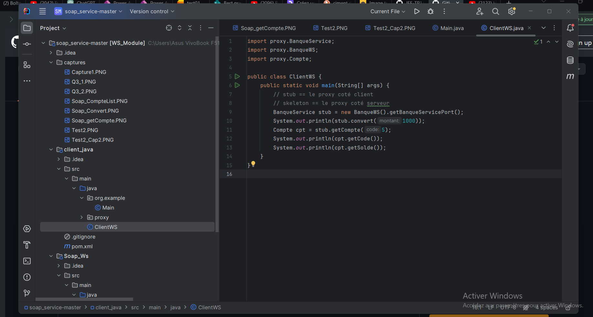
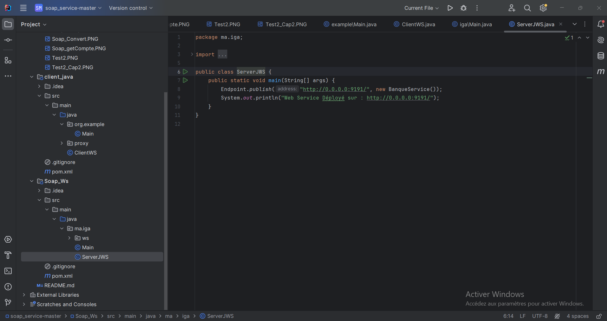
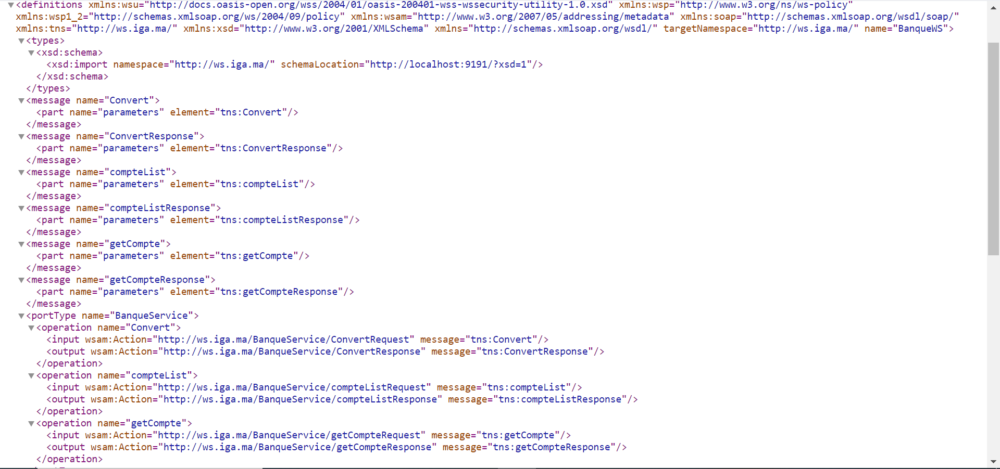
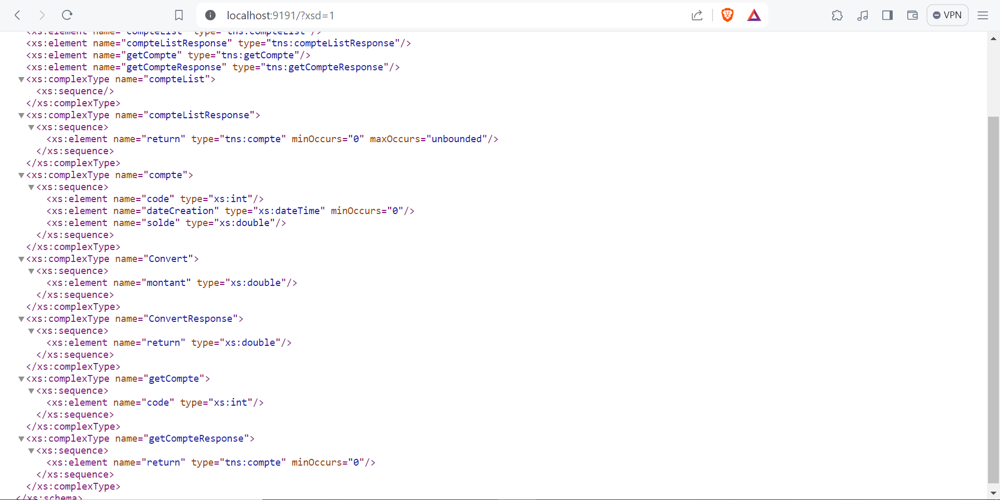
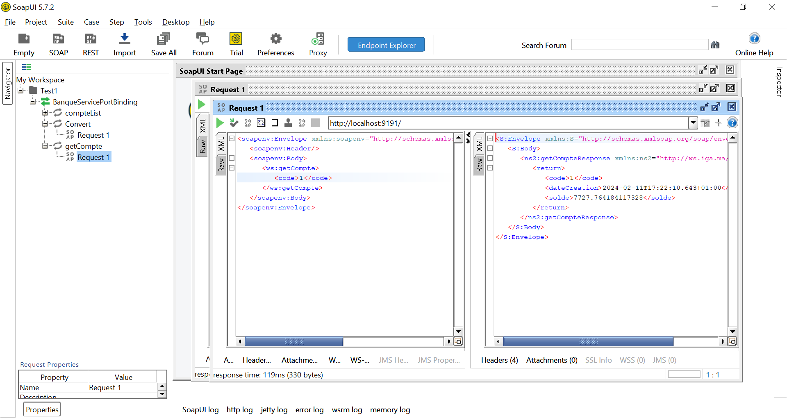
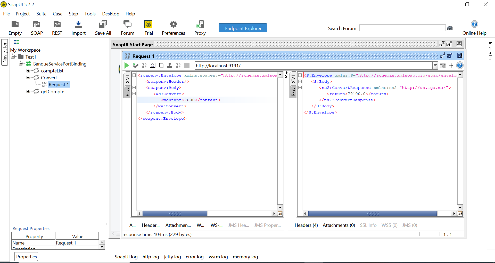
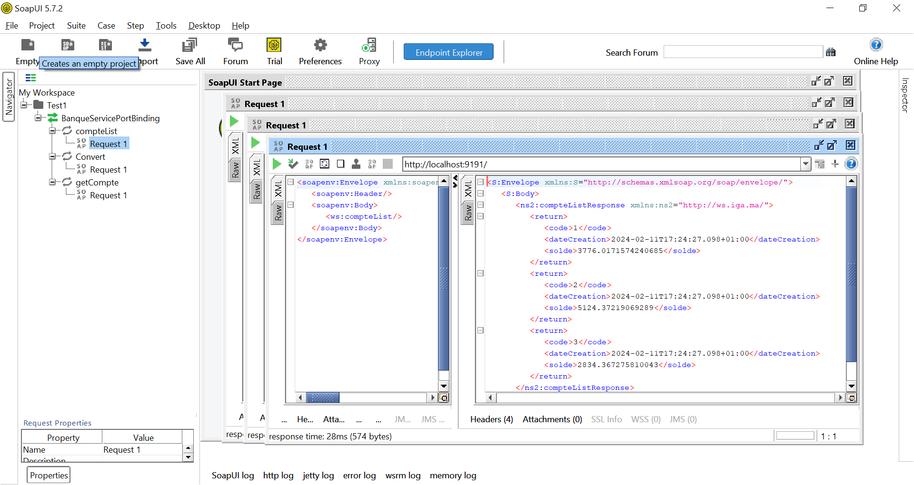
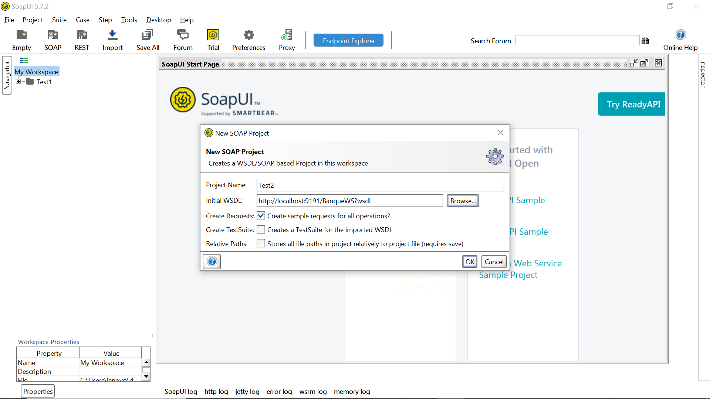
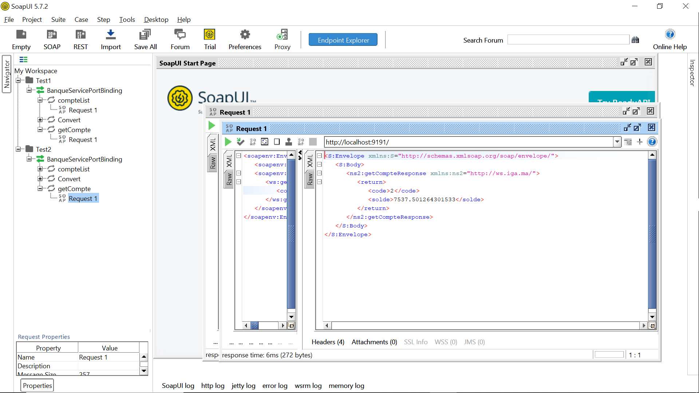

<h3>Compte Rendu</h3>

<ul>
    <li>1. Créer un Web service qui permet de : </li>
</ul>
    • Convertir un montant de l’auro en DH
    • Consulter un Compte
    • Consulter une Liste de comptes

<ul>
    <li> 2. Déployer le Web service avec un simple Serveur JaxWS </li>
</ul>

<ul> 
    <li> 3. Consulter et analyser le WSDL avec un Browser HTTP </li>
</ul>

<ul>
    <li>
        4. Tester les opérations du web service avec un outil
        comme SoapUI ou Oxygen
    </li>
</ul>

<ul>
    <li> 5. Créer un Client SOAP Java </li>
</ul>

